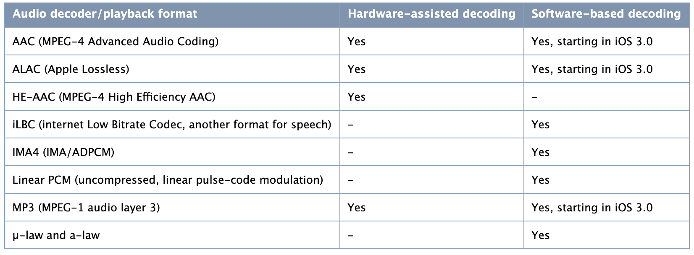
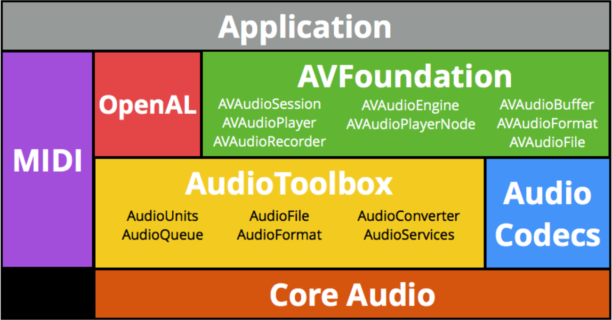

# iOS using Audio
iOS offers a rich set of tools for working with sound 
[Here](AudioBasic/README.md) is the link of basic concept of audio
- <b>AVFoundation Framework</b>
  - To play and Record audio using a simple interface
- <b>Audio Toolbox</b>
  - To Play audio with synchronization capabilities, access packets of incoming audio, parse audio streams, convert audio formats, and record audio with access to individual packets
- <b>OpenAL</b>
  - To Provide positional audio playback in games and other applications 

## The Basics: Audio Codecs, Supported Audio Formats, and Audio Sessions
### iOS Hardward and Software Audio codecs
Below is table about iOS Audio playback formats and codecs 
 
<b>Software codecs</b> support simultaneous playback of multiple sounds, but may entail significant CPU overhead 
<b>Hardware codecs</b> support only a single instance of one of the supported formats at a time

## iOS Audio Framework Introduction
- <b>CoreAudio & AudioToolbox</b>are the low-level C frameworks
- <b>AVFoundation</b> is an Objective-C/Swift framework
- <b>AVAudioEngine</b> is part of AVFoundation
 
